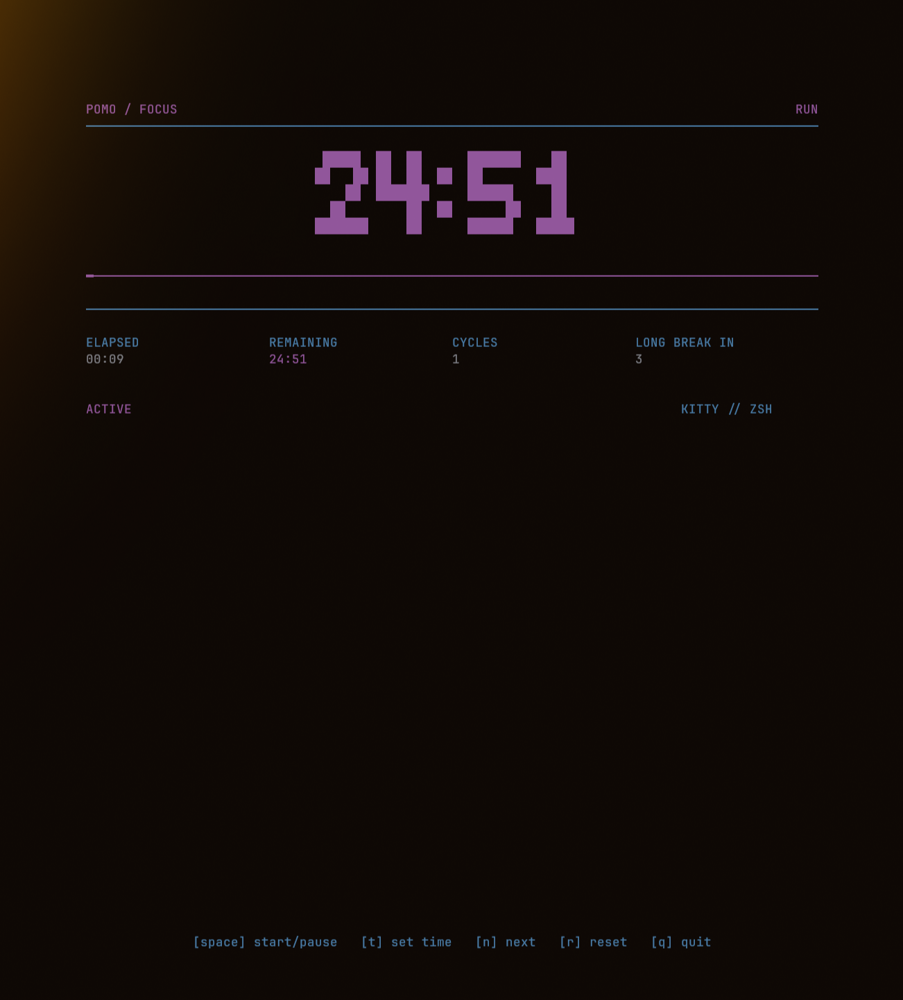

# Pomodoro Kitty

A clean, dependency-free terminal pomodoro timer for Arch Linux, Kitty, and ZSH.


## Run

```sh
cd /home/maks/Projects/pomodoro-kitty
./pomo
```

## Install

```sh
cd /home/maks/Projects/pomodoro-kitty
chmod +x install.sh
./install.sh
```

Then run:

```sh
pomo
```

Make sure `~/.local/bin` is on your `PATH` in `~/.zshrc`:

```sh
export PATH="$HOME/.local/bin:$PATH"
```

## Controls

- `space`: start or pause
- `t`: set a custom time for the current period
- `n`: skip to the next period
- `r`: reset the current period
- `q`: quit

The time prompt accepts minutes, seconds, or clock-style input:

```sh
25
25m
90s
1:30
```

## Options

```sh
pomo --focus 50 --short 10 --long 25 --rounds 3
pomo --no-notify
pomo --no-sound
```

Desktop notifications use `notify-send` when it is installed.
Completion sound uses a short low-volume beep and falls back to the terminal bell.
